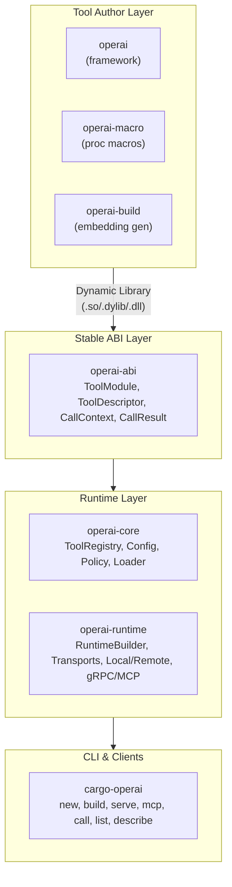

# Operai

A Rust framework for building, loading, and invoking AI agent tools with a dynamic plugin architecture, stable ABI, and policy-based execution control.

## Overview

Operai provides a complete solution for creating modular AI tools that can be:

- **Defined** using simple Rust functions with the `#[tool]` attribute macro
- **Built** as dynamic libraries with automatic JSON Schema generation
- **Loaded** at runtime with ABI version checking and validation
- **Invoked** locally or remotely via gRPC/MCP transports
- **Controlled** through CEL-based policy enforcement

## Features

- **🔧 Simple Tool Definition** — Use `#[tool]` to turn async Rust functions into discoverable tools
- **🔌 Dynamic Plugin Architecture** — Load tools from shared libraries at runtime
- **📊 Stable ABI** — Cross-version compatibility between tools and runtime
- **🔐 Credential Management** — Separate system and user credential namespaces
- **📜 Policy Enforcement** — CEL expressions for pre/post execution control
- **🔍 Semantic Search** — Embedding-based tool discovery
- **🌐 Network Transports** — gRPC and MCP (Model Context Protocol) support
- **🛠️ CLI Tooling** — `cargo operai` for project scaffolding, building, and serving

## Quick Start

### Installation

```bash
cargo install cargo-operai
```

### Create a New Tool Project

```bash
cargo operai new my-tool
cd my-tool
```

### Define a Tool

```rust
use operai::{Context, Result, tool};
use serde::{Deserialize, Serialize};

#[derive(Deserialize, schemars::JsonSchema)]
pub struct GreetInput {
    pub name: String,
}

#[derive(Serialize, schemars::JsonSchema)]
pub struct GreetOutput {
    pub message: String,
}

/// # Say Hello! (ID: greet)
///
/// Greets a user by name.
///
/// ## Capabilities
///
/// - greeting
///
/// ## Tags
///
/// - demo
#[tool]
pub async fn greet(_ctx: Context, input: GreetInput) -> Result<GreetOutput> {
    Ok(GreetOutput {
        message: format!("Hello, {}!", input.name),
    })
}

operai::generate_tool_entrypoint!();
```

### Build with Embeddings

```bash
cargo operai build
```

### Serve Tools

```bash
cargo operai serve
# Server listening on [::]:50051
```

### Invoke a Tool

```bash
cargo operai call my-tool.greet '{"name": "World"}'
# {"message": "Hello, World!"}
```

## Architecture



## Workspace Crates

| Crate                                      | Description                       |
| ------------------------------------------ | --------------------------------- |
| [`operai`](crates/operai/)                 | Main framework for defining tools |
| [`operai-abi`](crates/operai-abi/)         | Stable ABI types for FFI          |
| [`operai-core`](crates/operai-core/)       | Tool registry, config, and policy |
| [`operai-runtime`](crates/operai-runtime/) | Execution layer and transports    |
| [`operai-macro`](crates/operai-macro/)     | Procedural macros                 |
| [`operai-build`](crates/operai-build/)     | Build script support              |
| [`cargo-operai`](crates/cargo-operai/)     | CLI tool                          |

## Configuration

Tools and policies are configured via `operai.toml`:

```toml
[[tools]]
path = "target/release/libmy_tool.dylib"
enabled = true

[[policies]]
name = "rate-limit"
effects = [
    { stage = "Before", tools = ["*"], condition = "true", guard = "ctx.rate_limit < 100" }
]
```

## Building from Source

### Prerequisites

- Rust 2024 edition (nightly)
- Protocol Buffers compiler (`protoc`)

### Build

```bash
cargo build --workspace
```

### Test

```bash
cargo test --workspace
```

### Run Examples

```bash
cd examples/hello-world
cargo operai build
cargo operai serve
```

## Contributing

1. Fork the repository
2. Create a feature branch (`git checkout -b feature/my-feature`)
3. Commit your changes (`git commit -am 'Add new feature'`)
4. Push to the branch (`git push origin feature/my-feature`)
5. Open a Pull Request

## License

See [LICENSE](LICENSE) for details.
