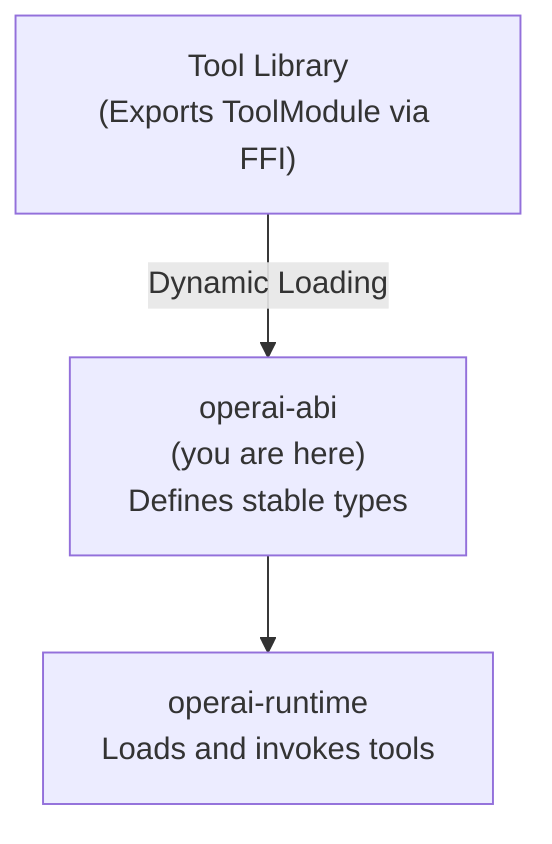

# operai-abi

Stable Application Binary Interface (ABI) for Operai tools.

## Overview

`operai-abi` defines the stable FFI types that enable dynamic loading of tool libraries across different versions of the Operai runtime. It ensures binary compatibility by using fixed-size, C-compatible representations for all types that cross the FFI boundary.

## Architecture Role

This crate is the foundation of the plugin system, sitting between tool libraries and the runtime:



## Key Features

### ABI Version Checking

```rust
pub const TOOL_ABI_VERSION: u32 = 1;
```

The runtime verifies that loaded libraries have a matching ABI version before invoking any functions.

### Core Types

| Type                           | Purpose                                            |
| ------------------------------ | -------------------------------------------------- |
| `ToolModule` / `ToolModuleRef` | Root module exported by tool libraries             |
| `ToolMeta`                     | Library metadata (ABI version, crate name/version) |
| `ToolDescriptor`               | Tool interface description (schemas, capabilities) |
| `ToolResult`                   | Status codes for tool operations                   |
| `RuntimeContext`               | Environment context during initialization          |
| `CallContext`                  | Request metadata and credentials for invocation    |
| `CallArgs`                     | Arguments for tool invocation                      |
| `CallResult`                   | Tool invocation result with output or error        |
| `InitArgs`                     | Arguments for library initialization               |

### ToolResult Enum

```rust
#[repr(u8)]
pub enum ToolResult {
    Ok = 0,
    Error = 1,
    InvalidInput = 2,
    Unauthorized = 3,
    NotFound = 4,
    RateLimited = 5,
    InitFailed = 6,
}
```

### ToolDescriptor Fields

- `id` — Unique tool identifier within the library
- `name` — Human-readable display name
- `description` — Tool description
- `input_schema` — JSON Schema for inputs
- `output_schema` — JSON Schema for outputs
- `credential_schema` — Required credentials schema
- `capabilities` — List of capability identifiers
- `tags` — Categorization tags
- `embedding` — Optional semantic search embedding

### CallContext Fields

- `request_id` — Unique request identifier
- `session_id` — Session identifier for stateful tools
- `user_id` — Authenticated user identifier
- `system_credentials` — rkyv-encoded system credentials
- `user_credentials` — rkyv-encoded user credentials

## Usage

Tool libraries typically don't use this crate directly—the `operai` crate's macros generate the necessary FFI exports. However, runtime implementations use it for loading:

```rust
use operai_abi::{ToolModuleRef, TOOL_ABI_VERSION};

fn verify_abi(module: ToolModuleRef) -> bool {
    module.meta.abi_version == TOOL_ABI_VERSION
}
```

## Stability Guarantees

- All public types use `#[repr(C)]` for stable layout
- All enums use explicit discriminants
- `#[non_exhaustive]` on enums allows future additions
- Types derive `StableAbi` from the `abi_stable` crate

## Dependencies

- [`abi_stable`](https://crates.io/crates/abi_stable) — Stable ABI primitives
- [`async-ffi`](https://crates.io/crates/async-ffi) — Async FFI support

## Build

```bash
cargo build
```

## Testing

```bash
cargo test
```

## License

See [LICENSE](../../LICENSE) for details.
