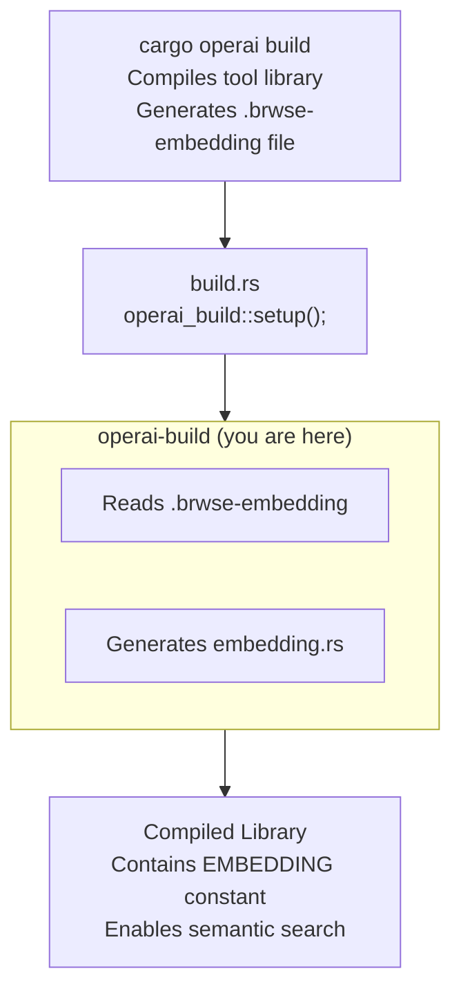

# operai-build

Build script support for embedding generation.

## Overview

`operai-build` provides build-time code generation for Operai projects. It reads pre-computed embedding vectors from a binary file and generates Rust constants that are compiled into the final binary.

## Architecture Role

This crate connects the build process to semantic search capabilities:



## Key Features

### `setup()` Function

The main entry point, called from your `build.rs`:

```rust
// build.rs
fn main() {
    operai_build::setup();
}
```

This function:

1. Sets the `operai_embedding` cfg flag
2. Reads `.brwse-embedding` if it exists
3. Generates `embedding.rs` in `OUT_DIR` with embedding constants
4. Registers the embedding file as a build dependency

### Generated Constants

When `.brwse-embedding` exists:

```rust
pub const EMBEDDING: &[f32] = &[0.1_f32, 0.2_f32, ...];
pub const EMBEDDING_DIM: usize = 1536;
```

When `.brwse-embedding` doesn't exist:

```rust
pub const EMBEDDING: &[f32] = &[];
pub const EMBEDDING_DIM: usize = 0;
```

### Embedding File Format

The `.brwse-embedding` file contains raw little-endian f32 values:

- Each float is serialized as 4 bytes (little-endian)
- File size must be divisible by 4
- Typically generated by `cargo operai build` using an embedding model

## Usage

### Add to Cargo.toml

```toml
[build-dependencies]
operai-build = "0.1"
```

### Create build.rs

```rust
fn main() {
    operai_build::setup();
}
```

### Include Generated Code

In your `lib.rs`:

```rust
#[cfg(operai_embedding)]
include!(concat!(env!("OUT_DIR"), "/embedding.rs"));

#[cfg(not(operai_embedding))]
pub const EMBEDDING: &[f32] = &[];
```

> **Note**: The `generate_tool_entrypoint!()` macro from `operai` handles this automatically.

### Build with Embeddings

```bash
cargo operai build
```

This command:

1. Generates embeddings from your tool's documentation
2. Writes `.brwse-embedding`
3. Triggers a rebuild with the embedding data

## Error Handling

The `setup()` function panics if:

- `OUT_DIR` environment variable is not set (indicates incorrect usage)
- Embedding file size is not divisible by 4 (invalid format)
- File I/O operations fail

## Build

```bash
cargo build
```

## Testing

```bash
cargo test
```

## License

See [LICENSE](../../LICENSE) for details.
