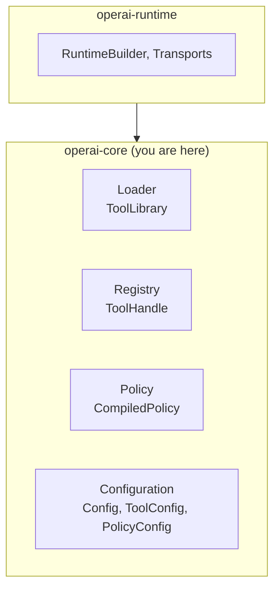

# operai-core

Core infrastructure for tool loading, management, and policy enforcement.

## Overview

`operai-core` provides the foundational runtime components for managing tool lifecycles. It handles dynamic library loading, tool registration, configuration parsing, and CEL-based policy evaluation.

## Architecture Role

This crate is the backend for tool management, used by `operai-runtime` to orchestrate execution:



## Key Features

### Tool Loading

`ToolLibrary` loads tool modules from dynamic libraries with:

- ABI version validation
- Optional checksum verification
- Graceful error handling

```rust
use operai_core::{ToolLibrary, LoadError};
use operai_abi::RuntimeContext;

let library = ToolLibrary::load("path/to/tool.so", None)?;
let module = library.module();
```

### Tool Registry

`ToolRegistry` provides centralized tool management:

```rust
use operai_core::ToolRegistry;
use operai_abi::RuntimeContext;

let mut registry = ToolRegistry::new();
let ctx = RuntimeContext::new();

// Load tools
registry.load_library("path/to/tool.so", None, None, &ctx).await?;

// Query tools
for tool in registry.list() {
    println!("{}: {}", tool.qualified_id, tool.description);
}

// Get a specific tool
if let Some(handle) = registry.get("crate.tool-id") {
    // Use handle.call() for invocation
}

// Semantic search
let results = registry.search(&query_embedding, 10);
```

### Tool Handle

`ToolHandle` provides tool invocation with in-flight tracking:

```rust
let handle = registry.get("my-crate.my-tool").unwrap();

// Track in-flight requests
let guard = registry.start_request_guard();

// Call the tool
let result = handle.call(call_context, input_bytes).await;
```

### Configuration System

Unified configuration resolution from `operai.toml`:

```rust
use operai_core::{Config, ConfigFile, ConfigKind};

// Automatic resolution (current dir → parent dirs → env var)
if let Some(config) = Config::load_resolved()? {
    for tool in config.enabled_tools() {
        println!("Tool: {}", tool.path);
    }
}

// Or load from explicit path
let config = Config::load("./operai.toml")?;
```

#### Config Types

| Type                | Purpose                             |
| ------------------- | ----------------------------------- |
| `Config`            | Main project configuration          |
| `ConfigFile`        | Unified resolution algorithm        |
| `ToolConfig`        | Individual tool settings            |
| `PolicyConfig`      | Inline or external policy reference |
| `CredentialsConfig` | System credential storage           |

#### operai.toml Format

```toml
[[tools]]
path = "target/release/libmy_tool.dylib"
enabled = true

[[policies]]
name = "rate-limit"
effects = [
    { stage = "Before", tools = ["*"], condition = "true", guard = "ctx.calls < 100" }
]

# Or reference external policy files
[[policies]]
path = "policies/security.toml"
```

### Policy System

CEL-based policy evaluation for controlling tool execution:

```rust
use operai_core::{Policy, Effect, policy::session::PolicySession};

let policy = Policy {
    name: "rate-limit".to_string(),
    effects: vec![
        Effect {
            stage: "Before".to_string(),
            tools: vec!["*".to_string()],
            condition: Some("true".to_string()),
            guard: Some("ctx.calls < 100".to_string()),
            fail_message: Some("Rate limit exceeded".to_string()),
            update: None,
        },
    ],
};

let compiled = policy.compile()?;
let mut session = PolicySession::default();

// Pre-execution check
let allowed = compiled.evaluate_pre_effects(&mut session, "tool.id", &input)?;

// Post-execution update
compiled.evaluate_post_effects(&mut session, "tool.id", &input, Ok(&output))?;
```

#### Effect Fields

| Field          | Description                                       |
| -------------- | ------------------------------------------------- |
| `stage`        | `"Before"` or `"After"` execution                 |
| `tools`        | Tool patterns (`"*"`, `"group.*"`, or exact name) |
| `condition`    | CEL expression to evaluate (default: `true`)      |
| `guard`        | CEL expression that must be `true` to proceed     |
| `fail_message` | Message when guard fails                          |
| `update`       | CEL expression to update session context          |

#### CEL Context Variables

- `input` — Tool input as JSON
- `output` — Tool output (After stage only)
- `error` — Error message (After stage, on failure)
- `tool` — Tool ID string
- `ctx` — Mutable session context
- `history` — List of previous invocations

### Session Management

```rust
use operai_core::policy::session::{PolicyStore, InMemoryPolicySessionStore};
use std::sync::Arc;

let session_store = Arc::new(InMemoryPolicySessionStore::new());
let policy_store = Arc::new(PolicyStore::new(session_store));
```

## Thread Safety

**Loading phase**: `ToolRegistry::load_library` requires `&mut self` and is not thread-safe.

**Execution phase**: Once wrapped in `Arc`, query methods (`get`, `list`, `search`) are thread-safe. Tool handles use interior `Arc` for concurrent invocation.

## Build

```bash
cargo build
```

## Testing

```bash
cargo test
```

## License

See [LICENSE](../../LICENSE) for details.
