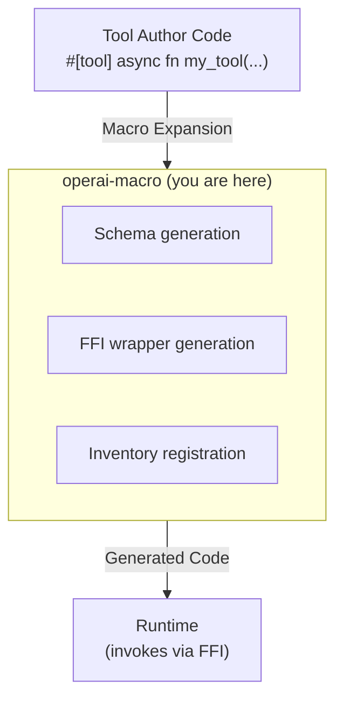

# operai-macro

Procedural macros for the Operai tool framework.

## Overview

`operai-macro` provides procedural macros for defining tools, lifecycle hooks, and credentials. It handles compile-time code generation for tool registration, schema extraction, and FFI wrapper creation.

## Architecture Role

This crate generates the boilerplate code that connects user-defined tools to the runtime:



## Key Features

### `#[tool]` Attribute Macro

Transforms async functions into registered tools:

```rust
use operai::{Context, Result, tool};

/// # My Tool (ID: my_tool)
///
/// Does something useful.
///
/// ## Capabilities
///
/// - read
/// - write
///
/// ## Tags
///
/// - utility
#[tool]
pub async fn my_tool(ctx: Context, input: MyInput) -> Result<MyOutput> {
    Ok(MyOutput { /* ... */ })
}
```

**Generated code includes:**

- JSON Schema extraction from `MyInput` and `MyOutput` types
- FFI-compatible wrapper function
- Registration with the tool inventory
- Doc comment metadata parsing

**Requirements:**

- Function must be `async`
- First parameter must be `Context`
- Second parameter must implement `Deserialize` and `JsonSchema`
- Return type must be `Result<T>` where `T` implements `Serialize` and `JsonSchema`

### `#[init]` Attribute Macro

Registers an async initialization function:

```rust
use operai::{Result, init};

#[init]
async fn setup() -> Result<()> {
    // Initialize resources (e.g., HTTP clients, database pools)
    Ok(())
}
```

**Requirements:**

- Function must be `async`
- Must take no parameters
- Called once when the library is loaded

### `#[shutdown]` Attribute Macro

Registers a synchronous cleanup function:

```rust
use operai::shutdown;

#[shutdown]
fn cleanup() {
    // Release resources
}
```

**Requirements:**

- Function must be synchronous (not `async`)
- Must take no parameters
- Called when the library is unloaded

### `define_system_credential!` Macro

Defines a system-level credential type:

```rust
use operai::define_system_credential;

define_system_credential!(ApiKey("api_key") {
    /// The API key value
    key: String,
    #[optional]
    /// Optional endpoint override
    endpoint: Option<String>,
});

// Generated:
// - struct ApiKey { key: String, endpoint: Option<String> }
// - impl ApiKey { fn get(ctx: &Context) -> Result<Self, CredentialError> }
// - Registration with credential inventory
```

### `define_user_credential!` Macro

Identical syntax to `define_system_credential!`, but retrieves from the user credential namespace:

```rust
use operai::define_user_credential;

define_user_credential!(UserApiKey("user_api_key") {
    /// User-specific API key
    key: String,
});
```

## Doc Comment Format

The `#[tool]` macro extracts metadata from specially formatted doc comments:

```
/// # Display Name (ID: custom_id)
///
/// Description text that appears in tool documentation.
///
/// ## Capabilities
///
/// - capability_one
/// - capability_two
///
/// ## Tags
///
/// - tag_one
/// - tag_two
```

| Section           | Description                                       |
| ----------------- | ------------------------------------------------- |
| H1 heading        | Tool display name with optional `(ID: custom_id)` |
| Description       | Text following the H1 heading                     |
| `## Capabilities` | List of capability identifiers                    |
| `## Tags`         | List of categorization tags                       |

## Error Messages

The macros provide helpful compile-time errors:

- Missing doc comments
- Malformed doc comment structure
- Non-async tool functions
- Invalid function signatures
- Async shutdown functions (must be sync)

## Build

```bash
cargo build
```

## Testing

```bash
cargo test
```

## License

See [LICENSE](../../LICENSE) for details.
