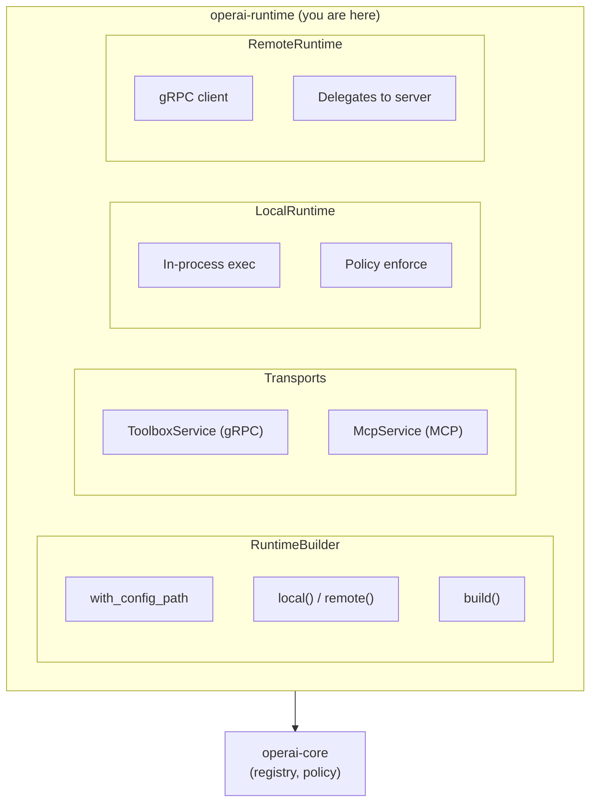

# operai-runtime

Runtime layer for tool execution and network access.

## Overview

`operai-runtime` provides the execution layer for the Operai tool system. It orchestrates tool loading, execution with policy enforcement, and exposes tools over network transports (gRPC and MCP).

## Architecture Role

This crate is the top-level runtime, building on `operai-core` for tool management:



## Key Features

### RuntimeBuilder

Fluent API for constructing runtime instances:

```rust
use operai_runtime::RuntimeBuilder;

// Local runtime with config
let runtime = RuntimeBuilder::new()
    .with_config_path("operai.toml")
    .local()
    .build()
    .await?;

// Remote runtime
let runtime = RuntimeBuilder::new()
    .remote("localhost:50051")
    .build()
    .await?;
```

#### Builder Methods

| Method                      | Description                        |
| --------------------------- | ---------------------------------- |
| `new()`                     | Create with defaults               |
| `with_config_path(path)`    | Set config file location           |
| `with_runtime_context(ctx)` | Set runtime context                |
| `local()`                   | Configure for in-process execution |
| `remote(endpoint)`          | Configure for remote execution     |
| `with_static_tool(module)`  | Add statically-linked tool         |
| `build()`                   | Build the configured runtime       |
| `build_local()`             | Build local runtime specifically   |
| `build_remote()`            | Build remote runtime specifically  |

### LocalRuntime

In-process execution with full policy enforcement:

```rust
use operai_runtime::{RuntimeBuilder, proto::*};

let runtime = RuntimeBuilder::new()
    .with_config_path("operai.toml")
    .local()
    .build_local()
    .await?;

// List tools
let response = runtime.list_tools(ListToolsRequest {
    page_size: 100,
    page_token: String::new(),
}).await?;

for tool in response.tools {
    println!("{}: {}", tool.name, tool.description);
}

// Call a tool
let result = runtime.call_tool(
    CallToolRequest {
        name: "tools/my-crate.my-tool".to_string(),
        input: Some(input_struct),
    },
    metadata,
).await?;
```

### RemoteRuntime

gRPC client for remote tool servers:

```rust
let runtime = RuntimeBuilder::new()
    .remote("http://localhost:50051")
    .build_remote()
    .await?;

// Same API as LocalRuntime
let tools = runtime.list_tools(request).await?;
```

### Runtime Enum

Abstracts over local and remote execution:

```rust
use operai_runtime::Runtime;

let runtime: Runtime = RuntimeBuilder::new()
    .local()  // or .remote("...")
    .build()
    .await?;

match runtime {
    Runtime::Local(local) => { /* in-process */ }
    Runtime::Remote(remote) => { /* gRPC client */ }
}
```

### gRPC Transport

`ToolboxService` implements the Toolbox gRPC service:

```rust
use operai_runtime::{ToolboxService, proto};
use tonic::transport::Server;

let service = ToolboxService::from_runtime(local_runtime.clone());

Server::builder()
    .add_service(proto::toolbox_server::ToolboxServer::new(service))
    .serve("[::]:50051".parse()?)
    .await?;
```

#### gRPC Methods

| Method        | Description                  |
| ------------- | ---------------------------- |
| `ListTools`   | List all available tools     |
| `SearchTools` | Semantic search by embedding |
| `CallTool`    | Invoke a tool with input     |

#### Request Headers

| Header                | Description                    |
| --------------------- | ------------------------------ |
| `x-request-id`        | Unique request identifier      |
| `x-session-id`        | Session identifier             |
| `x-user-id`           | User identifier                |
| `x-credential-{name}` | Base64-encoded credential data |

### MCP Transport (Feature-Gated)

Model Context Protocol support for AI assistant integration:

```rust
// Requires `mcp` feature
use operai_runtime::McpService;

let service = McpService::from_runtime(local_runtime.clone())
    .searchable(true)  // Enable semantic search mode
    .with_search_embedder(embedder);  // Optional: add search embedder
```

### Semantic Search

The `SearchEmbedder` trait enables embedding generation for semantic search:

```rust
use operai_runtime::{SearchEmbedder, SearchEmbedFuture};

struct MyEmbedder;

impl SearchEmbedder for MyEmbedder {
    fn embed_query(&self, query: &str) -> SearchEmbedFuture<'_> {
        let query = query.to_string();
        Box::pin(async move {
            // Generate embedding from query text
            Ok(vec![0.1, 0.2, 0.3])
        })
    }
}
```

### Proto Module

Generated protobuf types for the Toolbox service:

```rust
use operai_runtime::proto::{
    Tool,
    ListToolsRequest, ListToolsResponse,
    SearchToolsRequest, SearchToolsResponse,
    CallToolRequest, CallToolResponse,
};
```

## Features

| Feature | Description                  |
| ------- | ---------------------------- |
| `mcp`   | Enable MCP transport support |

## Build

```bash
cargo build
```

With MCP support:

```bash
cargo build --features mcp
```

## Testing

```bash
cargo test
```

## License

See [LICENSE](../../LICENSE) for details.
