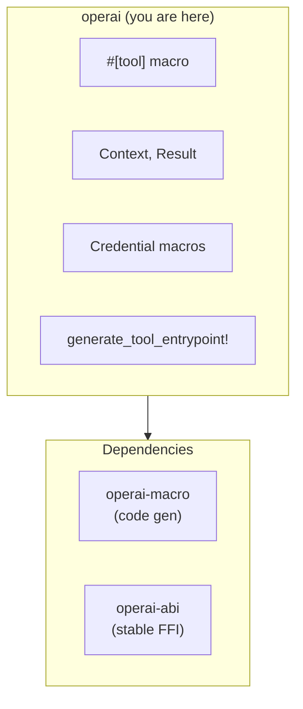

# operai

The main user-facing crate for defining Operai tools.

## Overview

`operai` provides the essential types, macros, and utilities for building AI agent tools. It serves as the primary interface for tool authors, offering a simple and ergonomic API for tool definition while handling the complexities of FFI, schema generation, and runtime registration internally.

## Architecture Role

This crate sits at the top of the framework stack, re-exporting types from lower-level crates (`operai-abi`, `operai-macro`) to provide a unified API. Tool authors only need to depend on this single crate.



## Key Features

### `#[tool]` Attribute Macro

Transforms async Rust functions into discoverable tools with automatic:

- JSON Schema generation from input/output types
- FFI wrapper generation
- Inventory-based registration

### Context API

The `Context` struct provides access to:

- `request_id()` — Unique request identifier
- `session_id()` — Session identifier for stateful tools
- `user_id()` — Authenticated user identifier
- `system_credential::<T>(name)` — System-level credentials
- `user_credential::<T>(name)` — User-provided credentials

### Lifecycle Hooks

- `#[init]` — Async function called when the tool library loads
- `#[shutdown]` — Sync function called when the library unloads

### Credential Definition Macros

- `define_system_credential!` — Operator-configured credentials
- `define_user_credential!` — Per-user credentials

### Entrypoint Generation

`generate_tool_entrypoint!()` generates the FFI module interface that the runtime uses to discover and invoke tools.

## Usage

### Basic Tool Definition

```rust
use operai::{Context, Result, tool};
use serde::{Deserialize, Serialize};

#[derive(Deserialize, schemars::JsonSchema)]
pub struct Input {
    pub query: String,
}

#[derive(Serialize, schemars::JsonSchema)]
pub struct Output {
    pub result: String,
}

/// # Search (ID: search)
///
/// Performs a search operation.
///
/// ## Capabilities
///
/// - search
/// - read
///
/// ## Tags
///
/// - utility
#[tool]
pub async fn search(_ctx: Context, input: Input) -> Result<Output> {
    Ok(Output {
        result: format!("Results for: {}", input.query),
    })
}

// Required at the end of lib.rs
operai::generate_tool_entrypoint!();
```

### Tool with Credentials

```rust
use operai::{Context, Result, define_system_credential, tool};

define_system_credential!(ApiKey("api_key") {
    /// API key for external service
    key: String,
    #[optional]
    /// Optional endpoint override
    endpoint: Option<String>,
});

/// # External API Call (ID: api_call)
///
/// Calls an external API.
#[tool]
pub async fn api_call(ctx: Context, input: Input) -> Result<Output> {
    let creds = ApiKey::get(&ctx)?;
    // Use creds.key and creds.endpoint
    Ok(Output { /* ... */ })
}
```

### Lifecycle Hooks

```rust
use operai::{Result, init, shutdown};
use std::sync::OnceLock;

static CLIENT: OnceLock<reqwest::Client> = OnceLock::new();

#[init]
async fn setup() -> Result<()> {
    CLIENT.set(reqwest::Client::new()).ok();
    Ok(())
}

#[shutdown]
fn cleanup() {
    // Release resources
}
```

## Doc Comment Format

The `#[tool]` macro extracts metadata from doc comments:

```rust
/// # Tool Display Name (ID: custom_id)
///
/// Description of what the tool does.
///
/// ## Capabilities
///
/// - capability_one
/// - capability_two
///
/// ## Tags
///
/// - tag_one
/// - tag_two
```

- **H1 heading**: Tool display name with optional `(ID: custom_id)` override
- **Description**: Text following the H1
- **Capabilities section**: List of capability identifiers
- **Tags section**: List of categorization tags

## Build

```bash
cargo build --release
```

The resulting `.dylib`/`.so`/`.dll` can be loaded by the Operai runtime.

## Testing

```bash
cargo test
```

## License

See [LICENSE](../../LICENSE) for details.
